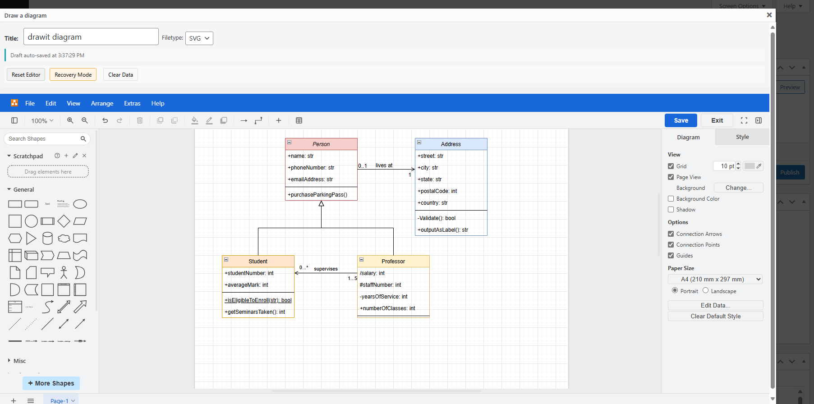
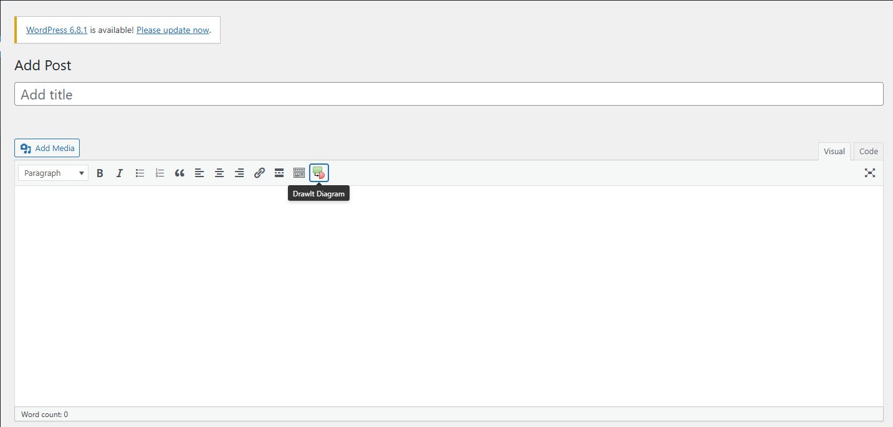
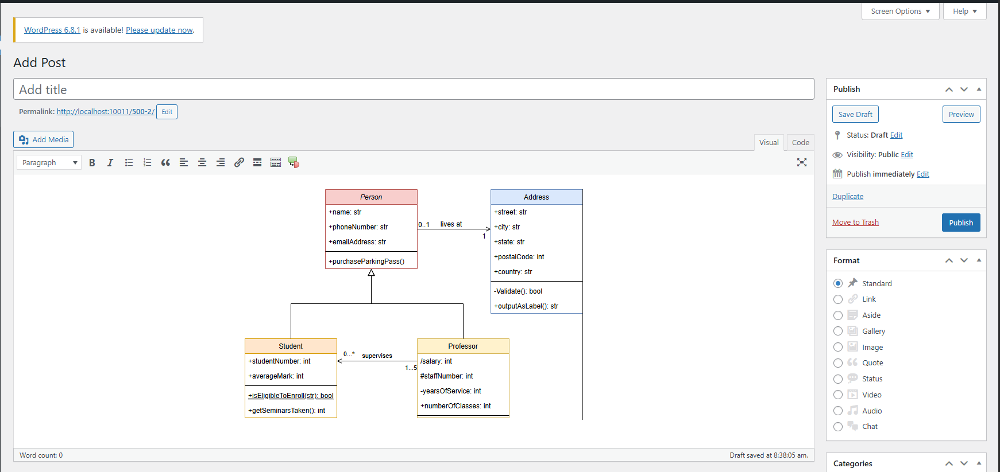

# DrawIt (draw.io)

A WordPress plugin that interfaces with draw.io to create and edit diagrams inline while editing posts.

## Description

DrawIt is a WordPress plugin that interfaces with the draw.io website to easily create beautiful diagrams, flow charts and drawings inline while you are editing a post. This powerful plugin saves the draw.io source code for your diagram and a PNG or SVG version of the image – providing crisp images that you can update without redrawing the diagram. There is also no hassle moving images back and forth between editors on your computer like typically is done without this plugin.

### Features

- Create diagrams directly within WordPress
- Multiple ways to add diagrams: Media Library, Visual Editor, or Text Editor
- Direct integration with draw.io's powerful interface
- Automatic source code saving for future editing
- Export as PNG or SVG
- Optional shortcode output for more flexibility
- Enhanced SVG security with sanitization

## Installation

1. Download latest release zip
2. Go to WP admin > Plugins > Add New
3. Upload plugin from zip file
4. Click "Install Now"
5. Click "Activate Plugin"

## Screenshots

| Screenshot | Description |
|------------|-------------|
|  | Button for creating/editing a diagram in TinyMCE Editor WordPress |
|  | Diagram editing interface |
|  | Diagram image result after saving |

## FAQ

### How do I edit a diagram?

To edit a diagram that you've already created, just select it (e.g., the source code in the text post editor or the image itself in the visual post editor) and then click on the DrawIt button in the editor!

### Where is the source code for my diagram saved?

The source code for the diagram is saved with the image in your WordPress installation. As long as you do not delete the image from your media library, then you will be able to open and edit the image from the post/page editor where it is being used.

### How do I edit a diagram that is only in the media library?

For now, you'll have to insert it into a post to be able to edit it. We'll work on improving this in future releases.

### How do I use shortcodes for diagrams?

When saving a diagram, check the "Save as shortcode" option. This will insert a shortcode like `[drawit id="123" title="My Diagram"]` instead of the image. The shortcode supports these attributes:

- `id` - Required. The attachment ID of the diagram
- `title` - Optional. Title for the diagram
- `class` - Optional. Additional CSS classes
- `align` - Optional. Alignment (left/center/right)
- `inline_svg` - Optional. Whether to render SVG diagrams inline (default: true)

### Are SVG diagrams secure?

Yes, the plugin automatically sanitizes SVG content by:

- Removing potentially harmful elements (script, iframe, etc.)
- Stripping dangerous attributes and JavaScript
- Validating SVG structure before saving
- This makes SVG diagrams safe to use while preserving their functionality.

## Roadmap

- Add option for saving draw.io XML source in the PNG or SVG directly, instead of only saving the source XML to the WP database

## Technical Details

- **Contributors**: Loc Hoang
- **Requires WordPress**: 4.0+
- **Tested up to**: 4.4
- **Stable tag**: 1.0.1
- **License**: [GPLv3](http://www.gnu.org/licenses/gpl-2.0.html)

## Notice

This plugin uses the [draw.io website](https://www.draw.io/), but is not affiliated with draw.io.

## Changelog

### 1.0.1

- Added shortcode support for more flexible diagram insertion
- Added SVG sanitization for enhanced security
- Added support for inline SVG rendering
- Fixed issues with draft saving and recovery
- Improved editor stability and error handling

### 1.0

- Initial release
